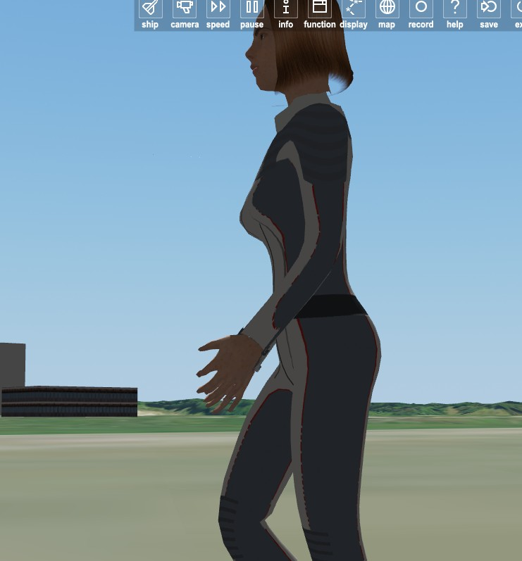

# Tantra and OrbiterCrew — public beta (Orbiter 2024)

The starship *Tantra* from Ivan Yefremov's *Andromeda* and OrbiterCrew, a crew system written from scratch: living, mocap-animated people with physiology, a space suit and a jet pack. Early beta: much is still rough.

## Install

1. Orbiter 2024 (x86) with the bundled D3D9Client and XRSound.
2. Unpack the archive into the Orbiter folder (it only adds files).
3. Scenarios: `Tantra / Beta`.

## Scenarios

| Scenario | What to do |
|---|---|
| **Beta 1 — Mars, jet pack at Tantra** | Fly the jet pack in Valles Marineris, walk into Tantra's feet (collision test), board the lift |
| **Beta 2 — Mars, commander's seat** | Raise the ship onto the stern, lift off on planetary engines, light the anamezon far out |
| **Beta 3 — Io, suit field** | Stand in Jupiter's radiation belts, switch the suit's magnetic field off and on |

The full controls are in each scenario's description in the Launchpad.

## OrbiterCrew

- **People.** Skeletal mocap animation (walk, run, jump, sit, stand up); two sets — without and with the suit.
- **Physiology.** O₂ and CO₂, stamina, body temperature, water, food, injuries by body part, radiation dose. Death from hypoxia, CO₂, heat or cold, radiation sickness, injuries.

- **Suit.** Life support, thermal control, 6 kWh battery, radiation shield: 2 g/cm² shell plus a 600 W magnetic field (charged-particle dose ÷30). The suit computer (H, mouse only) shows consumables, warnings, targets, maps.

- **Jet pack.** 12 kg metallic hydrogen, 2 × 500 N, ~950 m/s:
  - manual mode, or the assistant (safe thrust, upright hold);
  - STOP, landing, cruise;
  - transfer to bases and ships with landing on a pad;
  - rendezvous and docking in space.
- **Ships.** People board Tantra, walk inside and come back out.

## Tantra

- **Planetary engines.** Fusion in magnetic cups; thrust limited by field pressure (main cup 12.1 T, 886 MN; 4 pods × 3 cups, 350 MN each). Reaction mass: argon in air (~30 km/s), iron above 30 km (~300 km/s).

- **Anamezon drive.**
  - 4 magnetic reflector cups (~1000 T), 8.8 g pellets at up to 20 kHz.
  - Start-up: field → kaon seed beam → feed.
  - Products: charged mesons (62 %, 0.98 c) and γ (38 %). Effective exhaust ≈ 0.41 c, thrust 4 × 2.17·10¹⁰ N, reaction power 5·10¹⁹ W.
  - Interlocks: hot start below ~50 km in an atmosphere; radiation near oxygen worlds and crews. g-compensator up to 200 g.

- **Exhaust** from decay lengths and kinematics:
  - constrictions K⁰S ~0.13 m → K± ~18 m → K⁰L/π ~70–76 m → μ 6–8 km;
  - Doppler beaming;
  - in air, a muon-heated plasma channel with a shock wave.

- **Bridge.** Rotating capsule, 3-seat console, curved screen fed by external cameras, six Orbiter MFDs, engine / mechanism / power-plant screens — all by mouse from the seat.

## How to operate

**On foot**
- W/S walk (S brakes), A/D turn, Q/E side step, Shift run, Space jump.
- F1 eyes / outside view; right mouse held looks around.
- K suit on/off (off only in breathable air), L lamps, Shift+V sun shade.
- F = the action shown on screen (lift, airlock, door, seat).

**Jet pack** (B takes / drops it near the pack)
- Starts in MANUAL, with no compensation:
  - Space thrust up, left Ctrl down; numpad 0 / . throttle;
  - Shift+Space full thrust, Shift+Ctrl thrust off, while held;
  - in the air: W/S pod vector, A/D turn, Q/E strafe, Shift full vector;
  - J height hold, C landing autopilot, G booms, Caps Lock steering limiter.
- After touchdown the pods stay locked until the thrust keys are released and pressed again.

**Suit computer** (H, eyes view, mouse only)
- Left page: map, orbit, power and heat, options.
- Right page: targets, flight (cruise height and speed), transfer, landing, body.
- Top-right toggles: ASSIST, FIELD, LIGHT, SHADE, IR.
- Bottom buttons: HEIGHT HOLD, TRANSFER (target within 15 km), LANDING, STOP; in space: APPROACH, SYNC, HOLD, DOCK.

**Inside Tantra**
- W/S/A/D/Q/E, Shift (max 3 m/s); right mouse held turns the body with the look.
- F sits down at a seat or stands up. Not in the suit — take it off with K.
- Left click: screens and buttons within reach.
- In the commander's seat, V shows the ship from outside.
- Lift: from outside, F at its foot boards the lift, then click UP. To go out, click DOWN, then OUT.

**Bridge** (commander's seat; the person keeps the focus)
- Front screen: FLIGHT / ENGINES / PARAMETERS.
- Left screen: MECHANISMS (+ thermal). Right screen: POWER PLANT.
- Side glasses: six Orbiter MFDs, chosen on the right console.
- Numpad +/− throttle, Ctrl+ full, Ctrl− zero, * cut.
- Attitude 2/8, 4/6, 1/3; / rotation/linear; 5 kill rotation; Ins/Del trim.
- Power plant: Shift + [ ] ; ' L M (field, power, limiter, reaction mass).

**Flight sequence**
1. MECHANISMS → LAUNCH: the ship stands up on the stern.
2. POWER PLANT running; throttle up the planetary engines. Pods: GONDOLY lever and nozzle angle on ENGINES (0° aft, 90° down).
3. Far from planets: ENGINES → IGNITION (field → beam → feed), feed bar.
   - Below ~50 km in an atmosphere the anamezon is locked (hot start).
   - Near oxygen worlds and crews it is locked by radiation.
   - The bypass needs two presses within 3 s.
   - g-limiter on ENGINES.

From Tantra's own focus (F3), the keys are K planetary/anamezon, J next ignition stage, Shift+J stop, Ctrl+J interlock bypass, U stand up/lie down, B pods, N gear, C wings, O hangar, G g-limiter.

**Suit field** (FIELD on the suit computer)
- 600 W from the battery; it divides the charged-particle dose by 30.
- At Io: suit without the field ~0.38 Sv/h, with it ~0.02 Sv/h.
- With the field the battery lasts ~8–9 h.
- The field is the first load shed on overload or overheating.

## Legs and supports

- **Lying:** two swivelling blade legs (6 telescopic stages, 15.75 m, stroke 14.25 m) and a telescopic nose leg (9 sections), the third support.
- **Standing on the stern:** four telescopic stern legs.
- **Feet:** radial-rib footpads, R 12.2 m (blade legs), 11.25 m (stern legs), 6.35 m (nose leg):
  - 12 ribs on hinges, two struts per rib;
  - a nanotube-fabric dome and a skirt;
  - sized for loose sand (Terzaghi, local shear), margin 1.5.
- **Design case:** 52.3 kt launch mass on a 2.5 g planet, factor 1.5. Telescopes are checked as stepped columns (buckling and strength of the thinnest stage).
- **Raising:** the ship is driven as a mechanism, not bounced on springs:
  - the standing feet are fixed to the terrain;
  - trunnions travel on rails above the feet;
  - sway ≤ 0.55°;
  - about 2 min to stand.
- **Positions (MECHANISMS screen):** LEVEL → ON THREE → ON THE LEGS → 75° → LAUNCH, plus STOP and EMERGENCY STOP. Needs ground contact, gear fully down, the airlock lift stowed and the hangar closed.
- **Damage:**
  - each foot has 12 petals; struts, petals, the ankle and the collar can break;
  - five hull zones crush on belly or side impacts;
  - equipment has its own g-limits.

  A hard landing leaves broken parts behind as debris.
- **Rules:** the gear deploys only in the air (the blades have no room to open on the belly). Wings stay folded lying on the ground and while the carriage moves, open when standing on the stern.

## Language and fonts

- The suit computer and the ship's screens are **in Russian** in this beta. The scenario descriptions are in English.
- The suit computer uses its own built-in font (works on any Windows).
- The bridge screens use **Segoe UI** (part of Windows).
- The bridge **key lettering uses the TrueType font "GOST type A"**, which is not part of Windows and not included. Without it, Windows substitutes another font: the text stays readable, but some labels may not fit their keys. Install any "GOST type A" font yourself for the intended look.
- Some ship labels use "Arial Cyr" (a standard Windows Cyrillic alias).

## Known issues

- Footstep sounds play in vacuum.
- Only the feet are solid for a person outside (on foot, ship on the ground); the hull, upper legs and anything in flight are not.
- Jupiter's shadow on Io is not modelled.
- Time acceleration is limited to 10x while a person is outside a safe zone.
