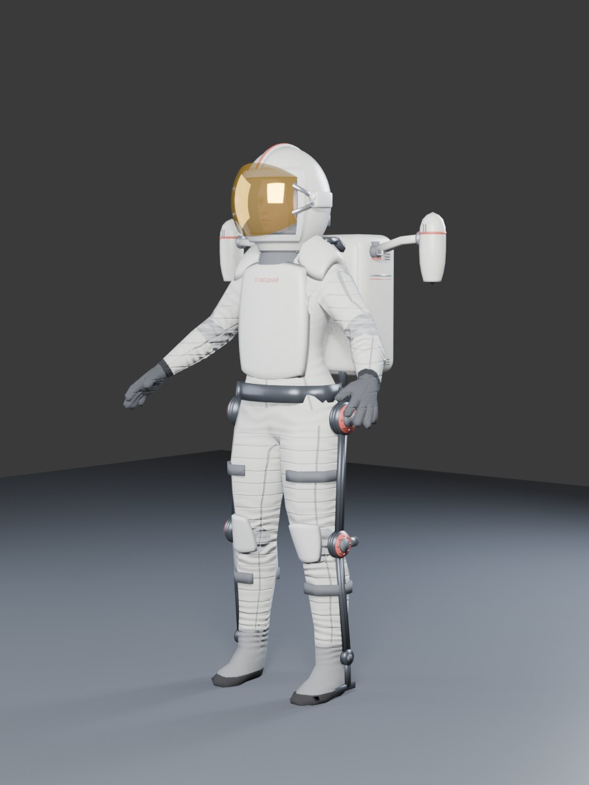
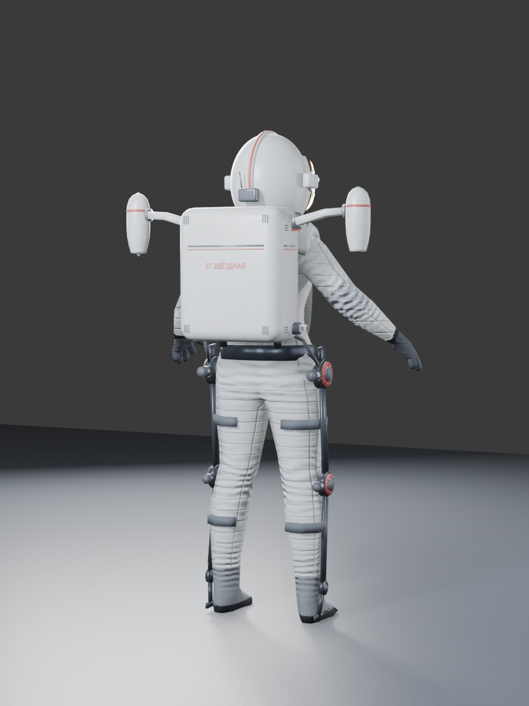

# Tantra, OrbiterCrew and MPU — public beta 0.2051026 (Orbiter 2024)

The starship *Tantra* from Ivan Yefremov's *Andromeda*; OrbiterCrew, a crew system written from scratch: living, mocap-animated people with physiology, a space suit and a jet pack; and the MPU, a fast 8×8 universal mobile platform driven by those people. Early beta: much is still rough.

## Packages

The beta comes as three archives. Each one only adds files; unpack them into the Orbiter folder.

| Archive | Contents | Needs |
|---|---|---|
| **OrbiterCrew** | people, suit, jet pack, helmet display, this manual | — (install it first) |
| **Tantra** | the starship, its bridge and interior, debris | OrbiterCrew |
| **MPU** | the universal mobile platform | OrbiterCrew; Beta 6 also needs Tantra |

Binaries only (no source code) in this beta.

## Install

1. A clean **Orbiter 2024** (x86) is enough — no other add-ons are needed. The DLLs use only the Microsoft Visual C++ 2015–2022 runtime that Orbiter 2024 itself needs.
2. Start Orbiter with **Orbiter_ng.exe** (the D3D9 graphics client bundled with Orbiter 2024). The inline-graphics `orbiter.exe` is not supported.
3. In the Launchpad, tab **Modules**, tick **XRSound** (bundled with Orbiter 2024) — all sound goes through it.
4. Unpack the archives into the Orbiter folder: OrbiterCrew first, then Tantra and/or MPU.
5. Scenarios: `Tantra / Beta`.

## Scenarios

| Scenario | Package | What to do |
|---|---|---|
| **Beta 1 — Mars, jet pack at Tantra** | Tantra | Fly the jet pack in Valles Marineris, walk into Tantra's feet (collision test), board the lift |
| **Beta 2 — Mars, commander's seat** | Tantra | Raise the ship onto the stern, lift off on planetary engines, light the anamezon far out |
| **Beta 3 — Io, suit field** | MPU | Stand in Jupiter's radiation belts, switch the suit's magnetic field off and on; drive the MPU |
| **Beta 4 — Earth, MPU at KSC** | MPU | Drive the MPU on firm ground in air: full sound, dust clouds |
| **Beta 5 — Moon, MPU at Brighton Beach** | MPU | Drive on regolith in vacuum: low grip, long skids, silent |
| **Beta 6 — Mars, MPU at Tantra** | MPU + Tantra | Drive round the ship; the platform meets Tantra's legs and feet |
| **Beta 7 — Moon, two MPU crash** | MPU | Two platforms 400 m apart: drive one into the other (F3 switches drivers) |
| **Beta 8 — Earth orbit, commander's seat** | Tantra | Tantra in low Earth orbit, Niza Krit on the bridge |
| **Beta 9 — Moon, jet pack at Brighton Beach** | OrbiterCrew | Put on the jet pack (B), fly, transfer to a base and land on a pad |

The full controls are in each scenario's description in the Launchpad.

## OrbiterCrew

- **People.** Skeletal mocap animation (walk, run, jump, sit, stand up); two sets — without and with the suit.
- **Physiology.** O₂ and CO₂, stamina, body temperature, water, food, injuries by body part, radiation dose. Death from hypoxia, CO₂, heat or cold, radiation sickness, injuries.

- **Suit.** Life support, thermal control, 6 kWh battery, radiation shield: 2 g/cm² shell plus a 600 W magnetic field (charged-particle dose ÷30). The suit computer (H, mouse only) shows consumables, warnings, targets, maps.

- **Jet pack.** 12 kg metallic hydrogen, 2 × 500 N, ~950 m/s:
  - manual mode, or the assistant (safe thrust, upright hold);
  - STOP, landing, cruise;
  - transfer to bases and ships with landing on a pad;
  - rendezvous and docking in space.
- **Ships.** People board Tantra, walk inside and come back out.

## Tantra

- **Planetary engines.** Fusion in magnetic cups; thrust limited by field pressure (main cup 12.1 T, 886 MN; 4 pods × 3 cups, 350 MN each). Reaction mass: argon in air (~30 km/s), iron above 30 km (~300 km/s).

- **Anamezon drive.**
  - 4 magnetic reflector cups (~1000 T), 8.8 g pellets at up to 20 kHz.
  - Start-up: field → kaon seed beam → feed.
  - Products: charged mesons (62 %, 0.98 c) and γ (38 %). Effective exhaust ≈ 0.41 c, thrust 4 × 2.17·10¹⁰ N, reaction power 5·10¹⁹ W.
  - Interlocks: hot start below ~50 km in an atmosphere; radiation near oxygen worlds and crews. g-compensator up to 200 g.

- **Exhaust** from decay lengths and kinematics:
  - constrictions K⁰S ~0.13 m → K± ~18 m → K⁰L/π ~70–76 m → μ 6–8 km;
  - Doppler beaming;
  - in air, a muon-heated plasma channel with a shock wave.

- **Bridge.** Rotating capsule, 3-seat console, curved screen fed by external cameras, six Orbiter MFDs, engine / mechanism / power-plant screens — all by mouse from the seat.

## How to operate

**On foot**
- W/S walk (S brakes), A/D turn, Q/E side step, Shift run, Space jump.
- F1 eyes / outside view; right mouse held looks around.
- K suit on/off (off only in breathable air), L lamps, Shift+V sun shade.
- F = the action shown on screen (lift, airlock, door, seat).

**Jet pack** (B takes / drops it near the pack)
- Starts in MANUAL, with no compensation:
  - Space thrust up, left Ctrl down; numpad 0 / . throttle;
  - Shift+Space full thrust, Shift+Ctrl thrust off, while held;
  - in the air: W/S pod vector, A/D turn, Q/E strafe, Shift full vector;
  - J height hold, C landing autopilot, G booms, Caps Lock steering limiter.
- After touchdown the pods stay locked until the thrust keys are released and pressed again.

**Suit computer** (H, eyes view, mouse only)
- Left page: map, orbit, power and heat, options.
- Right page: targets, flight (cruise height and speed), transfer, landing, body.
- Top-right toggles: ASSIST, FIELD, LIGHT, SHADE, IR.
- Bottom buttons: HEIGHT HOLD, TRANSFER (target within 15 km), LANDING, STOP; in space: APPROACH, SYNC, HOLD, DOCK.

**Inside Tantra**
- W/S/A/D/Q/E, Shift (max 3 m/s); right mouse held turns the body with the look.
- F sits down at a seat or stands up. Not in the suit — take it off with K.
- Left click: screens and buttons within reach.
- In the commander's seat, V shows the ship from outside.
- Lift: from outside, F at its foot boards the lift, then click UP. To go out, click DOWN, then OUT.

**Bridge** (commander's seat; the person keeps the focus)
- Front screen: FLIGHT / ENGINES / PARAMETERS.
- Left screen: MECHANISMS (+ thermal). Right screen: POWER PLANT.
- Side glasses: six Orbiter MFDs, chosen on the right console.
- Numpad +/− throttle, Ctrl+ full, Ctrl− zero, * cut.
- Attitude 2/8, 4/6, 1/3; / rotation/linear; 5 kill rotation; Ins/Del trim.
- Power plant: Shift + [ ] ; ' L M (field, power, limiter, reaction mass).

**Flight sequence**
1. MECHANISMS → LAUNCH: the ship stands up on the stern.
2. POWER PLANT running; throttle up the planetary engines. Pods: GONDOLY lever and nozzle angle on ENGINES (0° aft, 90° down).
3. Far from planets: ENGINES → IGNITION (field → beam → feed), feed bar.
   - Below ~50 km in an atmosphere the anamezon is locked (hot start).
   - Near oxygen worlds and crews it is locked by radiation.
   - The bypass needs two presses within 3 s.
   - g-limiter on ENGINES.

From Tantra's own focus (F3), the keys are K planetary/anamezon, J next ignition stage, Shift+J stop, Ctrl+J interlock bypass, U stand up/lie down, B pods, N gear, C wings, O hangar, G g-limiter.

**Suit field** (FIELD on the suit computer)
- 600 W from the battery; it divides the charged-particle dose by 30.
- At Io: suit without the field ~0.38 Sv/h, with it ~0.02 Sv/h.
- With the field the battery lasts ~8–9 h.
- The field is the first load shed on overload or overheating.

## Legs and supports

- **Lying:** two swivelling blade legs (6 telescopic stages, 15.75 m, stroke 14.25 m) and a telescopic nose leg (9 sections), the third support.
- **Standing on the stern:** four telescopic stern legs.
- **Feet:** radial-rib footpads, R 12.2 m (blade legs), 11.25 m (stern legs), 6.35 m (nose leg):
  - 12 ribs on hinges, two struts per rib;
  - a nanotube-fabric dome and a skirt;
  - sized for loose sand (Terzaghi, local shear), margin 1.5.
- **Design case:** 52.3 kt launch mass on a 2.5 g planet, factor 1.5. Telescopes are checked as stepped columns (buckling and strength of the thinnest stage).
- **Raising:** the ship is driven as a mechanism, not bounced on springs:
  - the standing feet are fixed to the terrain;
  - trunnions travel on rails above the feet;
  - sway ≤ 0.55°;
  - about 2 min to stand.
- **Positions (MECHANISMS screen):** LEVEL → ON THREE → ON THE LEGS → 75° → LAUNCH, plus STOP and EMERGENCY STOP. Needs ground contact, gear fully down, the airlock lift stowed and the hangar closed.
- **Damage:**
  - each foot has 12 petals; struts, petals, the ankle and the collar can break;
  - five hull zones crush on belly or side impacts;
  - equipment has its own g-limits.

  A hard landing leaves broken parts behind as debris.
- **Rules:** the gear deploys only in the air (the blades have no room to open on the belly). Wings stay folded lying on the ground and while the carriage moves, open when standing on the stern.

## MPU — universal mobile platform (test sample)

- **Vehicle:** an open 8×8 platform with a driver's post up front.
  - airless wheels with hub motors, active suspension, all-wheel steering;
  - battery drive with energy recovered on braking.
- **Wheel–soil physics (terramechanics, not a game tyre curve):**
  - sinkage and rolling resistance from Bekker's pressure–sinkage law;
  - traction against wheel slip from the Janosi–Hanamoto shear law; side force from the same shear against the slip angle, plus bulldozing of the soil in front of a sliding wheel;
  - the side force comes first inside the friction circle — the platform stays stable, but past the grip it slides honestly;
  - soils per body: Moon — lunar regolith (Lunar Sourcebook values), Mars — sand (assumed within the rovers' estimates), Earth — firm loam;
  - grip, wheelspin, sliding and skids come out of the soil and the local gravity: the same platform behaves differently on each world.
- **Suspension:** independent and sprung on every wheel — squat on take-off, dive on braking, roll in turns. At the start the platform waits on its wheels until the terrain has loaded; parked, it stands still on its brake.
- **Drive:** 8 hub motors, 3 MW in all; 1 MWh battery with energy recovered on braking; the speed limit holds downhill too (the motors brake). Traction control on W; none with Shift.
- **Driven only by a person** — it never drives itself, and the focus stays on the person:
  1. Walk up to the platform anywhere round it and press F to climb onto the deck; F at the console takes the post.
  2. W forward (40 km/h), Shift+W full power (80 km/h), A/D steer (all-wheel; the rear wheels counter-steer at low speed).
  3. S — service brake with ABS (the wheels keep turning and steering); from a standstill S reverses (15 km/h).
  4. Space — emergency brake (the wheels lock, it skids). B — parking brake.
  5. Caps Lock raises the deck by 0.25 m / lowers it back (the normal height is the lowest).
  6. V — the platform from outside; V again — the driver's view.
  7. F at the post steps back; F at the deck edge steps down to the ground.
- **Status:** speed, battery, power draw and range — at the bottom of the screen, or in the helmet display when the driver wears the suit.
- **Dust and sound:** dust from the wheels (ballistic in vacuum, a cloud in air). Sound only through air: none on the Moon, faint on Mars, full on Earth.
- **Time warp:** above 2× the suspension is stiff; above 4× the platform is parked.

## Collisions

- **A person and Tantra:** a person on foot is stopped at the rim of Tantra's footpads while the ship stands on the ground.
- **MPU and people:** a person struck by the platform takes the blow on their own side (injuries through the suit).
- **MPU and Tantra:** the platform meets the ship's standing legs and feet (Tantra exports them for other vehicles).
- **MPU and MPU:** platforms collide with each other, pushed by their masses.
- **Crash:** above 30 km/h the people on the deck are thrown forward and may hit the ground or a support.
- Not yet:
  - the hull and upper legs;
  - anything in flight (a person on the jet pack passes through the ship).

## Language, fonts and encodings

The suit computer and the ship's screens are **in Russian** in this beta; the scenario descriptions are in English. The Russian text stays Russian on any Windows (English, US, other locales). How each part draws its text:

| Where | How | On non-Russian Windows |
|---|---|---|
| Suit computer and its messages | own bitmap font (Jura), Cyrillic baked into a texture | identical everywhere, independent of the system locale |
| Bridge screens | Segoe UI, Unicode text | Segoe UI ships with every Windows, Cyrillic included |
| Bridge key lettering | "GOST type A", Unicode text | stays Russian; if the font is missing Windows substitutes another one — readable, but some labels may not fit their keys |
| Ship status in Orbiter's HUD, interior labels | "Arial Cyr", single-byte Windows-1251 text | correct through the standard Windows alias "Arial Cyr" → Cyrillic Arial; would break only on a system without that alias |
| Scenario descriptions | plain ASCII English | — |

"GOST type A" is not part of Windows and not included; install any "GOST type A" TrueType font yourself for the intended look.

## Credits and third-party licences

The ship, the MPU, the suit, the jet pack, the interiors, the code and the MPU sounds are our own work. Third-party material used:

| What | Source | Licence |
|---|---|---|
| Human body, skin, eyes, brows, lashes, boots, rig | MakeHuman / MPFB system assets | CC0 |
| Hair | `cortu_strawberry_cloud_hair`, MakeHuman Community | CC0 |
| Coverall fabric relief (normal map) | `elvs_racing_fire_suit_female1` by Elvaerwyn, MakeHuman Community | CC BY 4.0 |
| Walk and run motion | 100STYLE dataset (I. Mason, S. Starke, T. Komura, 2022) | CC BY 4.0 |
| Sitting and standing-up motion | CMU Graphics Lab Motion Capture Database, mocap.cs.cmu.edu (created with funding from NSF EIA-0196217) | free to use |
| Footsteps, impacts | Kenney, "Impact Sounds" | CC0 |
| Suit and step effects | OwlishMedia, "Sound Effects Pack" (OpenGameArt) | CC0 |
| Breathing | mikeask, "Breathing Tired" (OpenGameArt) | CC0 |
| Helmet display font | Jura, The Jura Project Authors | SIL Open Font License 1.1 (text in `Textures\Tantra\HudFont_Jura_OFL.txt`) |

## Known issues

- Footstep sounds play in vacuum.
- Collisions: not yet with the hull, the upper legs or anything in flight (see Collisions).
- MPU: the wheels have no rotation of their own yet (slip is solved from the forces); no ground sounds under the wheels.
- Jupiter's shadow on Io is not modelled.
- Time acceleration is limited to 10x while a person is outside a safe zone.
